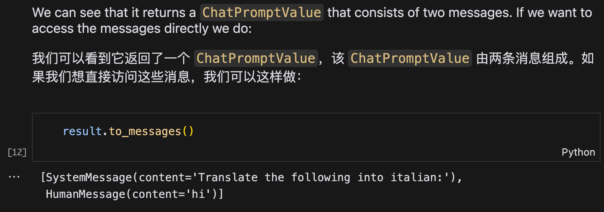
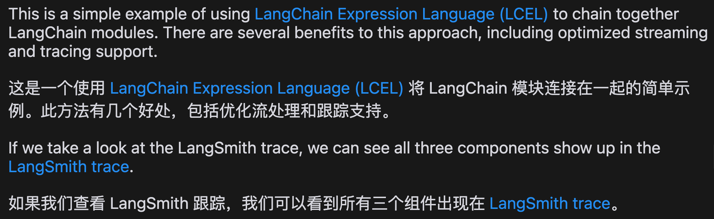
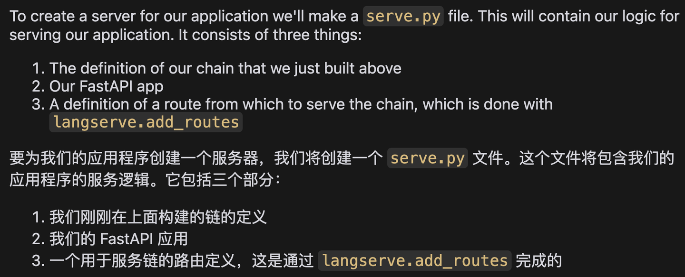
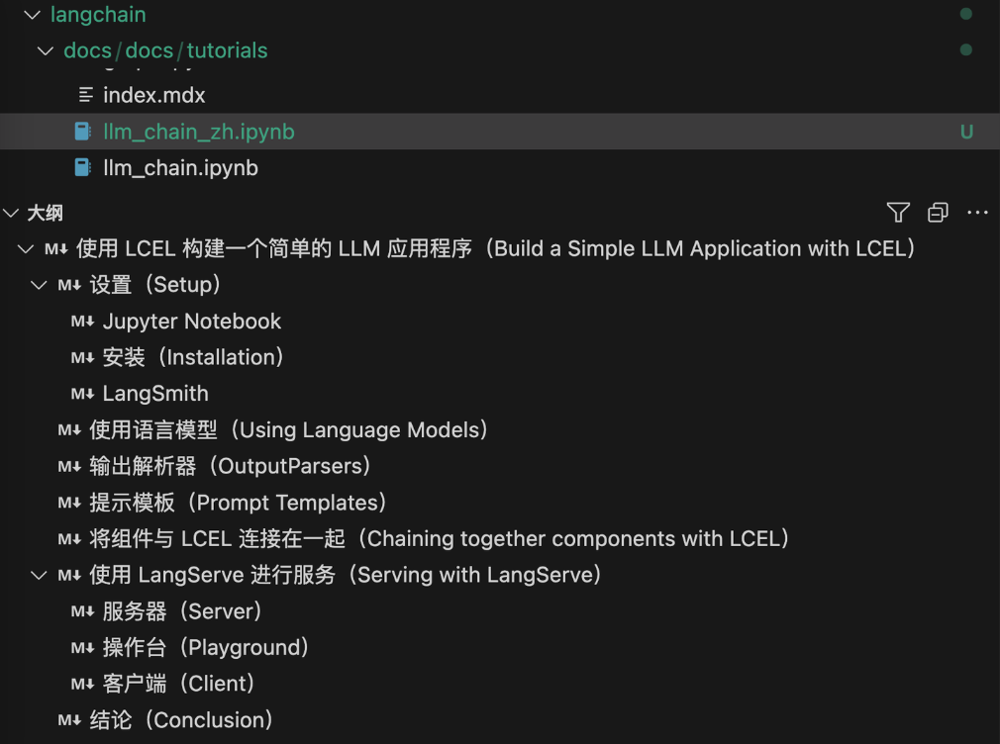
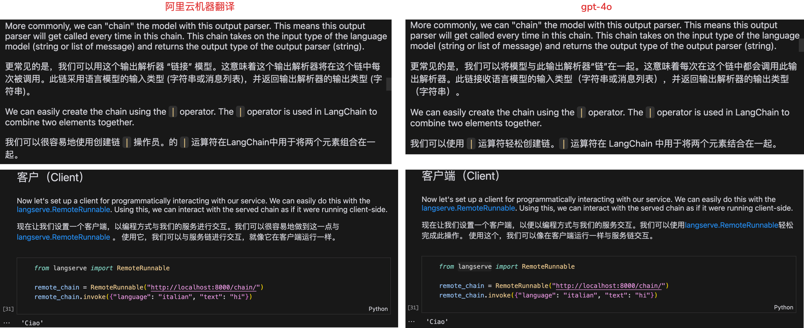

# Jupyter Notebook 翻译工具

这是一个用于将 Jupyter Notebook 中的 Markdown 单元格翻译为中文的工具。

## 功能

- 将 .ipynb 文件中的 Markdown 单元格翻译为中文
- 提供两种翻译引擎：阿里云机器翻译和 AI 翻译
- 保留原文，在原文后添加翻译后的文本
- 对原文进行分段，对于每一段单独进行翻译和拼接，方便阅读
- 自动处理和保留特殊的 Markdown 语法元素
- 在使用 AI 翻译时，如果产生了生成过长无关内容的幻觉现象，则自动进行检测并重新翻译

## 安装

1. 克隆此仓库:

```bash
git clone https://github.com/jexonn/jupyter-translate.git
cd jupyter-translate
```

2. 安装依赖:

```bash
pip install -r requirements.txt
```

3. 配置:
   

复制 `config.ini.example` 文件并重命名为 `config.ini`，然后配置阿里云机器翻译的密钥、兼容 OpenAI 接口协议的大模型 API 密钥、请求地址、模型名称。

## 使用方法

使用以下命令运行翻译工具:

```bash
python main.py [-e {ali,ai}] input_file.ipynb
```

参数说明:
- `-e, --engine`: 选择翻译引擎, `ali` 表示阿里云机器翻译, `ai` 表示 AI 翻译 (默认: `ali`)
- `input_file.ipynb`: 要翻译的 Jupyter Notebook 文件路径

例如:

```bash
python main.py -e ai input_file.ipynb
```

这将生成一个名为 `input_file_zh.ipynb` 的新文件。

## 注意事项

- 大模型翻译效果更好，但有小概率会出现幻觉
- 翻译结果可能需要进行人工校对以确保准确性

## 效果

只翻译 markdown 单元格，不翻译代码单元格和输出单位格：



链接和行内代码不翻译，避免歧义：





标题翻译格式为“译文（原文）”，以便浏览大纲，其中专有名词和短语不翻译：



使用阿里云机器翻译和使用大模型 gpt-4o 的 API 翻译效果对比：


